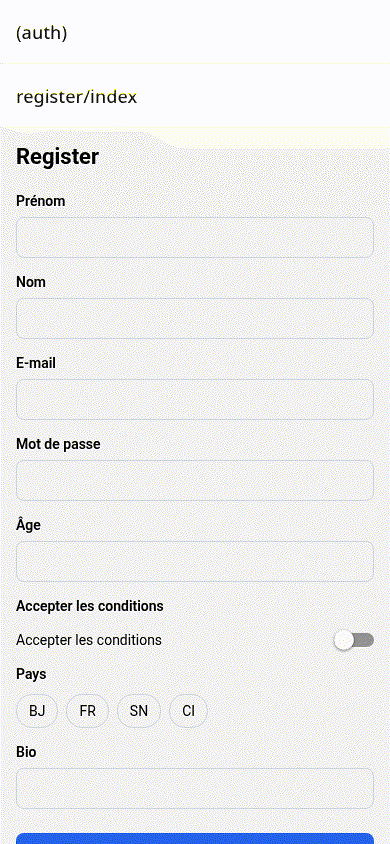

# rn-schema-ui

> **Du schéma Zod à l’écran React Native — formulaires, états et tests générés.**

> **Note dépôt GitHub :** le code de **rn-schema-ui** (monorepo `rn-formkit`) est hébergé temporairement sur [`Monde123/Rn_motion`](https://github.com/Monde123/Rn_motion) — le dépôt GitHub s’appelle encore **Rn_motion** (limites du token : pas de création/renommage de repo). Renommez-le côté GitHub quand possible (ex. `rn-schema-ui`).

Codegen (pas un runtime Formik-like) : Zod ou JSON Schema → écran typé, validation, loading/error/empty/success, tests RNTL.

## Install

```bash
# Après publication npm :
npx rn-schema-ui generate ./schemas/user.ts --out ./app/register

# Aujourd’hui (monorepo local) :
cd rn-formkit && npm install && npm run build
node packages/cli/bin/rn-schema-ui.js --help
```

Runtime optionnel :

```bash
# workspace : @rn-schema-ui/runtime (peer: react, react-native, zod)
```

## Quickstart

```bash
node packages/cli/bin/rn-schema-ui.js init
node packages/cli/bin/rn-schema-ui.js generate ./schemas/example.ts \
  --out ./app/example --name Example --adapter plain --router expo
```

Schéma réel (`schemas/user.ts`) :

```ts
import { z } from 'zod';

export const userSchema = z.object({
  firstName: z.string().min(1),
  lastName: z.string().min(1),
  email: z.string().email(),
  password: z.string().min(8),
  age: z.coerce.number().int().min(18),
  acceptTerms: z.boolean(),
  country: z.enum(['BJ', 'FR', 'SN', 'CI']),
  bio: z.string().max(280).optional(),
});
```

### Avant / après

**Avant** — câbler à la main `TextInput`, erreurs, clavier, a11y, tests…

**Après** :

```bash
node packages/cli/bin/rn-schema-ui.js generate ./schemas/user.ts \
  --out ./example/app/\(auth\)/register --name Register
```

→ `index.tsx` + `__tests__/Register.test.tsx` prêts à tourner sous Expo.

## Types de champs supportés

| Kind                | UI                       | Notes                                 |
| ------------------- | ------------------------ | ------------------------------------- |
| string              | TextInput                |                                       |
| email               | TextInput                | `keyboardType=email-address`          |
| password            | TextInput                | nom `password` / `motDePasse` ou meta |
| number              | TextInput                | `numeric`                             |
| boolean             | Switch                   |                                       |
| enum                | chips Pressable          |                                       |
| date                | TextInput                | hint AAAA-MM-JJ                       |
| optional / nullable | —                        | unwrap                                |
| object (1 niveau)   | section + `parent.child` | unflatten au submit                   |
| array primitives    | liste + Ajouter          |                                       |

## Adapters & router

- `--adapter plain|paper` (paper partiel)
- `--router expo|rn`
- `--watch` régénère à la sauvegarde du schéma
- `--dry-run`

## Example

```bash
cd example && npx expo start
# appareil réel : docs/expo-go.md
npx expo export --platform web
```

## Démo



## Qualité

```bash
npm run lint && npm run typecheck && npm test && npm run size && npm run bench:generate
```

Voir [QUALITE.md](./QUALITE.md), [CHANGELOG.md](./CHANGELOG.md), [docs/](./docs/).

## Licence

MIT © 2026 Moïse Koudanko
